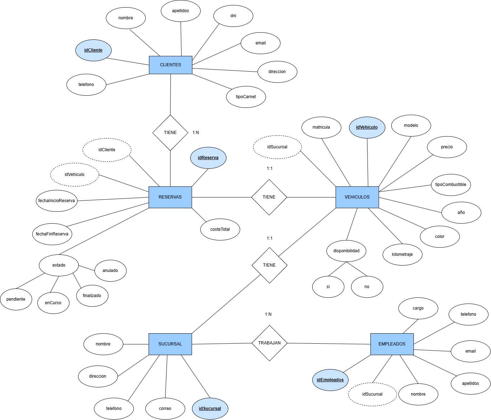
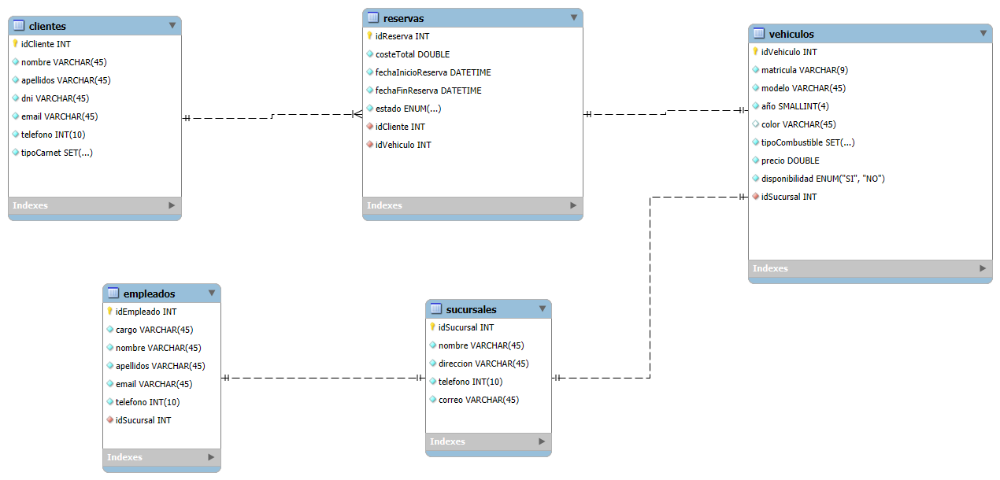

# 1. Portada


# 2. Índice

3. Introduccion
4. Análisis del enunciado
5. Modelo conceptual
6. Modelo relacional
7. Implementación en MySQL
8. Consultas propuestas
9. Ampliación de base de datos
10. Vistas y triggers
11. Conclusión

## 3. Introducción
El presente informe tiene como objetivo analizar y diseñar un sistema de gestión para la empresa **CarRentalX**, dedicada al alquiler de coches. La empresa busca modernizar sus procesos, actualmente manuales, para optimizar la gestión de clientes, vehículos, reservas, sucursales y empleados. Este documento ofrece una visión estructurada del sistema requerido, identificando las entidades clave, sus relaciones y posibles mejoras mediante funcionalidades adicionales.

# 4. Análisis del Enunciado

## 🛠️ Problemas Detectados

### Ineficiencia en la gestión manual
La gestión actual provoca retrasos, errores humanos, falta de control sobre el estado de los vehículos y dificultad para tomar decisiones rápidas.

### Falta de centralización
La información se encuentra dispersa, dificultando la visibilidad global de la operación, duplicando esfuerzos y limitando el acceso en tiempo real a los datos.

## 🎯 Objetivo Principal

- Diseñar un sistema de gestión integral que unifique la información de:
  - Clientes
  - Vehículos
  - Reservas
  - Sucursales
  - Empleados

- Automatizar tareas repetitivas, como:
  - La actualización de disponibilidad de vehículos.
  - La generación de informes.

## 🧩 Entidades Principales

- **Clientes**  
  Datos personales, tipo de carnet y su historial de reservas.

- **Vehículos**  
  Información técnica (modelo, matrícula, color, combustible), estado (disponible/no disponible) y precio.

- **Reservas**  
  Registro de alquileres, incluyendo fechas, cliente asociado y estado (pendiente, en curso, finalizada).

- **Sucursales**  
  Ubicación y datos de contacto de cada sede.

- **Empleados**  
  Información personal, rol y asignación a sucursales.

## ⚙️ Requisitos Funcionales

- **Gestión integral de recursos**  
  Administración de clientes, vehículos, reservas, sucursales y empleados desde una única plataforma.

- **Gestión avanzada de reservas**  
  Crear, modificar y cancelar reservas con verificación de disponibilidad en tiempo real.

- **Generación de informes personalizados**, como:

  - 🚗 **Vehículos más alquilados**  
    Ayuda a optimizar el inventario.

  - 👤 **Clientes más frecuentes**  
    Facilita estrategias de fidelización.

  - 💰 **Ingresos mensuales por sucursal**  
    Información financiera clave para la toma de decisiones.

# 5. Modelo conceptual



# 6. Modelo relacional




 # 7. Implementación en MySQL

## Creación de tablas

```sql
-- MySQL Workbench Synchronization
-- Generated: 2025-04-11 12:45
-- Model: New Model
-- Version: 1.0
-- Project: Name of the project
-- Author: Yo

SET @OLD_UNIQUE_CHECKS=@@UNIQUE_CHECKS, UNIQUE_CHECKS=0;
SET @OLD_FOREIGN_KEY_CHECKS=@@FOREIGN_KEY_CHECKS, FOREIGN_KEY_CHECKS=0;
SET @OLD_SQL_MODE=@@SQL_MODE, SQL_MODE='ONLY_FULL_GROUP_BY,STRICT_TRANS_TABLES,NO_ZERO_IN_DATE,NO_ZERO_DATE,ERROR_FOR_DIVISION_BY_ZERO,NO_ENGINE_SUBSTITUTION';

CREATE SCHEMA IF NOT EXISTS `CarRentalX` DEFAULT CHARACTER SET utf8 ;

CREATE TABLE IF NOT EXISTS `CarRentalX`.`clientes` (
  `idCliente` INT(11) NOT NULL AUTO_INCREMENT,
  `nombre` VARCHAR(45) NOT NULL,
  `apellidos` VARCHAR(45) NOT NULL,
  `dni` VARCHAR(45) NOT NULL,
  `email` VARCHAR(45) NOT NULL,
  `telefono` INT(10) NOT NULL,
  `tipoCarnet` SET('A', 'B', 'C', 'D', 'E', 'AM', 'A1', 'A2', 'B1', 'C1', 'D1', 'BE', 'C1E', 'CE', 'D1E', 'DE') NOT NULL,
  PRIMARY KEY (`idCliente`))
ENGINE = InnoDB
DEFAULT CHARACTER SET = utf8;

CREATE TABLE IF NOT EXISTS `CarRentalX`.`reservas` (
  `idReserva` INT(11) NOT NULL AUTO_INCREMENT,
  `fechaInicioReserva` DATETIME NOT NULL,
  `fechaFinReserva` DATETIME NOT NULL,
  `estado` ENUM("pendiente", "enCurso", "finalizado", "anulado") NOT NULL,
  `idCliente` INT(11) NOT NULL,
  `idVehiculo` INT(11) NOT NULL,
  PRIMARY KEY (`idReserva`),
  INDEX `fk_reservas_clientes_idx` (`idCliente` ASC),
  INDEX `fk_reservas_vehiculos1_idx` (`idVehiculo` ASC),
  CONSTRAINT `fk_reservas_clientes`
    FOREIGN KEY (`idCliente`)
    REFERENCES `CarRentalX`.`clientes` (`idCliente`)
    ON DELETE NO ACTION
    ON UPDATE NO ACTION,
  CONSTRAINT `fk_reservas_vehiculos1`
    FOREIGN KEY (`idVehiculo`)
    REFERENCES `CarRentalX`.`vehiculos` (`idVehiculo`)
    ON DELETE NO ACTION
    ON UPDATE NO ACTION)
ENGINE = InnoDB
DEFAULT CHARACTER SET = utf8;

CREATE TABLE IF NOT EXISTS `CarRentalX`.`vehiculos` (
  `idVehiculo` INT(11) NOT NULL AUTO_INCREMENT,
  `matricula` VARCHAR(9) NOT NULL,
  `modelo` VARCHAR(45) NOT NULL,
  `año` SMALLINT(4) NOT NULL,
  `color` VARCHAR(45) NULL DEFAULT NULL,
  `tipoCombustible` SET("gasolina", "diesel", "electrico", "hibrido", "gas", "hidrogeno") NOT NULL,
  `precio` DOUBLE NOT NULL DEFAULT 150.00,
  `disponibilidad` ENUM("SI", "NO") NOT NULL,
  `idSucursal` INT(11) NOT NULL,
  PRIMARY KEY (`idVehiculo`),
  INDEX `fk_vehiculos_sucursales1_idx` (`idSucursal` ASC),
  CONSTRAINT `fk_vehiculos_sucursales1`
    FOREIGN KEY (`idSucursal`)
    REFERENCES `CarRentalX`.`sucursales` (`idSucursal`)
    ON DELETE NO ACTION
    ON UPDATE NO ACTION)
ENGINE = InnoDB
DEFAULT CHARACTER SET = utf8;

CREATE TABLE IF NOT EXISTS `CarRentalX`.`sucursales` (
  `idSucursal` INT(11) NOT NULL AUTO_INCREMENT,
  `nombre` VARCHAR(45) NOT NULL,
  `direccion` VARCHAR(45) NOT NULL,
  `telefono` INT(10) NOT NULL,
  `correo` VARCHAR(45) NOT NULL,
  PRIMARY KEY (`idSucursal`))
ENGINE = InnoDB
DEFAULT CHARACTER SET = utf8;

CREATE TABLE IF NOT EXISTS `CarRentalX`.`empleados` (
  `idEmpleado` INT(11) NOT NULL AUTO_INCREMENT,
  `cargo` VARCHAR(45) NOT NULL,
  `nombre` VARCHAR(45) NOT NULL,
  `apellidos` VARCHAR(45) NOT NULL,
  `email` VARCHAR(45) NOT NULL,
  `telefono` INT(10) NOT NULL,
  `idSucursal` INT(11) NOT NULL,
  PRIMARY KEY (`idEmpleado`),
  INDEX `fk_empleados_sucursales1_idx` (`idSucursal` ASC),
  CONSTRAINT `fk_empleados_sucursales1`
    FOREIGN KEY (`idSucursal`)
    REFERENCES `CarRentalX`.`sucursales` (`idSucursal`)
    ON DELETE NO ACTION
    ON UPDATE NO ACTION)
ENGINE = InnoDB
DEFAULT CHARACTER SET = utf8;


SET SQL_MODE=@OLD_SQL_MODE;
SET FOREIGN_KEY_CHECKS=@OLD_FOREIGN_KEY_CHECKS;
SET UNIQUE_CHECKS=@OLD_UNIQUE_CHECKS;

```

# Inserción de datos de prueba

## Insertar datos de clientes
``` sql
INSERT INTO clientes 

VALUES   

(DEFAULT, 'Juan', 'Pérez', '12345678A', 'juan.perez@gmail.com', 612345678, 'A'),  

(DEFAULT, 'Ana', 'García', '87654321B', 'ana.garcia@gmail.com', 623456789, 'B'),  

(DEFAULT, 'Carlos', 'López', '11223344C', 'carlos.lopez@gmail.com', 634567890, 'C'), 

(DEFAULT, 'Manuel', 'Jiménez', '3215678A', 'manuel.jimenez@gmail.com', 652145423, 'A,B');
```
## Insertar datos de sucursal
``` sql
INSERT INTO sucursales 

VALUES  

(DEFAULT, 'Sucursal Central', 'Calle Mayor 123', 912345678, 'central@gmail.com'), 

(DEFAULT, 'Sucursal Norte', 'Calle Norte 456', 923456789, 'norte@gmail.com'), 

(DEFAULT, 'Sucursal Sur', 'Calle Sur 789', 934567890, 'sur@gmail.com'); 
```
## Insertar datos de vehículos
``` sql
INSERT INTO vehiculos 

VALUES  

(DEFAULT, '1234ABC', 'Ford Fiesta', 2020, 'Rojo', 'gasolina', 100.5, 'SI', 1), 

(DEFAULT, '5678DEF', 'BMW X5', 2019, 'Azul', 'diesel', 250.75, 'NO', 2), 

(DEFAULT, '9101GHI', 'Tesla Model 3', 2021, 'Negro', 'electrico', 500.0, 'SI', 3), 

(DEFAULT, '123ABC', 'Toyota Corolla', 2020, 'Rojo', 'gasolina', 35.99, 'SI', 1), 

(DEFAULT, '456DEF', 'Ford Focus', 2021, 'Azul', 'gasolina,diesel', 40.50, 'SI', 2);
```
## Insertar datos de reservas
``` sql
INSERT INTO reservas 

VALUES  

(DEFAULT, '2025-03-10 10:00:00', '2025-03-12 10:00:00', 'pendiente', 1, 1), 

(DEFAULT, '2025-03-10 12:00:00', '2025-03-12 10:00:00', 'pendiente', 1, 1), 

(DEFAULT, '2025-03-15 12:00:00', '2025-03-18 12:00:00', 'enCurso', 2, 2), 

(DEFAULT, '2025-03-20 09:00:00', '2025-03-22 09:00:00', 'finalizado', 3, 3), 

(DEFAULT,'2025-03-24 19:00:00', '2025-03-28 09:00:00', 'anulado', 3, 3);
```
## Insertar datos de empleados
``` sql
INSERT INTO empleados 

VALUES  

(DEFAULT, 'Gerente', 'María', 'Martínez', 'maria.martinez@gmail.com', 611223344, 1), 

(DEFAULT, 'Asesor', 'Pedro', 'Gómez', 'pedro.gomez@gmail.com', 622334455, 2), 

(DEFAULT, 'Recepcionista', 'Lucía', 'Sánchez', 'lucia.sanchez@gmail.com', 633445566, 3) 
```


# 8. Consultas propuestas

```sql
## 1. Listar todos los clientes con su información personal.
SELECT * 
FROM clientes;

## 2. Buscar un cliente por su DNI, nombre o email.
SELECT * 
FROM clientes
WHERE email = "juan.perez@gmail.com";

## 3. Contar cuántos clientes hay registrados.
SELECT COUNT(*) AS cantidad_clientes
FROM clientes;

## 4. Obtener los clientes que han realizado al menos una reserva.
SELECT DISTINCT clientes.idCliente , clientes.nombre
FROM clientes
JOIN reservas 
ON clientes.idCliente = reservas.idCliente;

## 5. Listar los clientes de mayor a menor reservas realizadas
SELECT clientes.idCliente, clientes.nombre, COUNT(reservas.idReserva) AS cantidad_reservas
FROM clientes
JOIN reservas ON clientes.idCliente = reservas.idCliente
GROUP BY clientes.idCliente, clientes.nombre
ORDER BY cantidad_reservas DESC;

## 6. Listar todos los vehículos con sus detalles técnicos.
SELECT * FROM vehiculos;

## 7. Buscar un vehículo cuya matrícula empiece por 1.
 SELECT * FROM vehiculos
 WHERE matricula 
 LIKE ("1%");
 
## 8. Vehículos más alquilados (se cuentan los estados finalizados o en curso de las reservas)
SELECT vehiculos.idVehiculo, vehiculos.modelo, COUNT(reservas.idReserva) AS cantidad_alquileres
FROM reservas
JOIN vehiculos ON reservas.idVehiculo = vehiculos.idVehiculo
WHERE reservas.estado IN ('enCurso', 'finalizado')
GROUP BY vehiculos.idVehiculo
ORDER BY cantidad_alquileres DESC;
    
## 9. Obtener los vehículos disponibles en una sucursal específica.
SELECT * 
FROM vehiculos 
WHERE disponibilidad = "SI";

## 10. Contar cuántos vehículos hay de cada tipo de combustible.
SELECT tipoCombustible, COUNT(tipoCombustible) 
FROM vehiculos 
GROUP BY tipoCombustible;

## 11. Obtener todas las reservas realizadas con fechas de inicio y fin.
SELECT *
FROM reservas
WHERE fechaInicioReserva != "" 
AND fechaFinReserva != "";

## 12. Contar cuántas reservas hay en cada estado (pendiente, en curso, finalizado, anulado).
SELECT idReserva, estado, COUNT(estado) 
FROM reservas 
GROUP BY estado;

## 13. Obtener las reservas pendientes en este momento.
SELECT *
FROM reservas 
WHERE estado = "pendiente";

## 14. Contar el número de vehículos reservados en estado "enCurso"
SELECT DISTINCT vehiculos.idVehiculo, vehiculos.modelo
FROM reservas 
JOIN vehiculos ON reservas.idVehiculo = vehiculos.idVehiculo
WHERE reservas.estado = 'enCurso';

## 15. Contar cuántas reservas se han realizado por mes/año.
SELECT DAY(fechaInicioReserva) AS dia,  
COUNT(*) AS num_reservas
FROM reservas
GROUP BY dia;

## 16. Listar todas las sucursales con su información.
SELECT * FROM sucursales;

## 17. Contar cuántos vehículos hay en cada sucursal.
SELECT sucursales.idSucursal, sucursales.nombre, COUNT(vehiculos.idVehiculo) 
FROM sucursales
LEFT JOIN vehiculos ON sucursales.idSucursal = vehiculos.idSucursal
GROUP BY sucursales.idSucursal, sucursales.nombre;

## 18. Determinar qué sucursal ha generado más ingresos en reservas.
SELECT sucursales.idSucursal, sucursales.nombre, SUM(vehiculos.precio) AS total_ingresos
FROM sucursales
JOIN vehiculos ON sucursales.idSucursal = vehiculos.idSucursal
JOIN reservas ON vehiculos.idVehiculo = reservas.idVehiculo
WHERE reservas.estado IN ('enCurso', 'finalizado')
GROUP BY sucursales.idSucursal;

## 19. Listar los empleados asignados a cada sucursal.
SELECT empleados.idEmpleado, empleados.nombre, empleados.apellidos, sucursales.nombre AS nombre_sucursal
FROM empleados
JOIN sucursales ON empleados.idSucursal = sucursales.idSucursal;

## 20. Identificar sucursales con reservas registradas para el 10 de marzo de 2025.
SELECT * FROM reservas 
WHERE fechaInicioReserva
LIKE ("%2025-03-10%");

## 21. Lista todos los empleados.
SELECT * 
FROM empleados;

## 22. Listar todos los empleados con su cargo y sucursal asignada.
SELECT empleados.nombre, empleados.cargo, sucursales.nombre AS nombre_sucursal
FROM empleados
JOIN sucursales ON empleados.idSucursal = sucursales.idSucursal;

## 23. Buscar empleados por nombre.
SELECT * 
FROM empleados
WHERE nombre = "Pedro";

## 24. Contar cuántos empleados hay en cada sucursal.
SELECT sucursales.nombre AS nombre_sucursal, COUNT(empleados.idEmpleado) AS empleados_por_sucursal
FROM empleados
JOIN sucursales ON empleados.idSucursal = sucursales.idSucursal
GROUP BY sucursales.idSucursal;

## 25. Identificar la dirección de la sucursal a la que pertenece un empleado.
SELECT empleados.nombre, sucursales.nombre 
FROM sucursales
JOIN empleados ON sucursales.idSucursal = empleados.idSucursal
WHERE empleados.idEmpleado = 2;
```
# 9. Ampliación de la base de datos

## Creación de tabla de pagos

```sql
### Tabla de pagos

CREATE TABLE pagos (
  idPago INT PRIMARY KEY AUTO_INCREMENT,
  idReserva INT NOT NULL,
  fechaPago DATE NOT NULL,
  metodoPago VARCHAR(50),         
  cantidad DECIMAL(10, 2) NOT NULL,
  estadoPago VARCHAR(20),        
  FOREIGN KEY (idReserva) REFERENCES reservas(idReserva)
);
```

## Creación de tabla de mantenimientos

```sql
CREATE TABLE mantenimientos (
  idMantenimiento INT PRIMARY KEY AUTO_INCREMENT,
  idVehiculo INT NOT NULL,
  fecha DATE NOT NULL,
  tipo VARCHAR(100),               
  costo DECIMAL(10, 2),
  descripcion TEXT,
  FOREIGN KEY (idVehiculo) REFERENCES vehiculos(idVehiculo)
);
```

## Inserción de datos en la tabla de pagos

```sql
INSERT INTO pagos VALUES
(DEFAULT, 1, '2025-04-01', 'tarjeta', 100.50, 'pagado'),
(DEFAULT, 2, '2025-04-02', 'efectivo', 150.00, 'pagado'),
(DEFAULT, 3, '2025-04-03', 'transferencia', 200.75, 'pendiente'),
(DEFAULT, 4, '2025-04-04', 'tarjeta', 120.00, 'pagado');
```

## Inserción de datos en la tabla de mantenimientos

```sql
INSERT INTO mantenimientos  VALUES
(DEFAULT, 1, '2025-04-01', 'cambio aceite', 30.00, 'Cambio de aceite y filtros'),
(DEFAULT, 2, '2025-04-02', 'revisión frenos', 50.00, 'Revisión de frenos y pastillas'),
(DEFAULT, 3, '2025-04-03', 'reemplazo llanta', 80.00, 'Reemplazo de llanta dañada'),
(DEFAULT, 4, '2025-04-04', 'alineación ruedas', 40.00, 'Alineación y balanceo de ruedas');
```

    
# 10. Vistas y triggers

## Vistas
```sql
## 1. Vista de reservas activas
CREATE VIEW reservas_activas AS
SELECT clientes.nombre, clientes.apellidos, reservas.estado
FROM reservas
JOIN clientes ON reservas.idCliente = clientes.idCliente
WHERE reservas.estado = 'enCurso' OR reservas.estado = 'pendiente';

## 2. Vista de vehiculos disponibles por sucursal
CREATE VIEW vehiculos_disponibles_por_sucursal AS
SELECT vehiculos.modelo, vehiculos.matricula, sucursales.nombre AS nombreSucursal
FROM vehiculos
JOIN sucursales ON vehiculos.idSucursal = sucursales.idSucursal
WHERE vehiculos.disponibilidad = 'SI';

## 3. Vista de pagos de cada reserva
CREATE VIEW pagos_por_reservas AS
SELECT reservas.idReserva, clientes.nombre, pagos.cantidad, pagos.metodoPago, pagos.estadoPago
FROM pagos
JOIN reservas ON pagos.idReserva = reservas.idReserva
JOIN clientes ON reservas.idCliente = clientes.idCliente;

## 4. Vista de mantenimiento de vehiculos
CREATE VIEW mantenimiento_vehiculos AS
SELECT 
  vehiculos.modelo,
  vehiculos.matricula,
  mantenimientos.tipo,
  mantenimientos.fecha,
  mantenimientos.descripcion
FROM mantenimientos
JOIN vehiculos ON mantenimientos.idVehiculo = vehiculos.idVehiculo;

## 5. Vista de empleados por sucursal
CREATE VIEW empleado_por_sucursal AS
SELECT 
  empleados.idEmpleado,
  empleados.nombre AS nombreEmpleado,
  empleados.cargo,
  sucursales.idSucursal,
  sucursales.nombre,
  sucursales.direccion
FROM empleados
JOIN sucursales ON empleados.idSucursal = sucursales.idSucursal;

## 6. Vista de vehiculos alquilados
CREATE VIEW vehiculos_actualmente_alquilados AS
SELECT 
  vehiculos.idVehiculo,
  vehiculos.modelo,
  vehiculos.matricula,
  reservas.idReserva,
  reservas.fechaInicioReserva,
  reservas.fechaFinReserva,
  clientes.nombre,
  clientes.apellidos
FROM vehiculos
JOIN reservas ON vehiculos.idVehiculo = reservas.idVehiculo
JOIN clientes ON reservas.idCliente = clientes.idCliente
WHERE reservas.estado = 'enCurso';

## 7. Vista de facturación total por cliente
CREATE VIEW facturacion_total_por_cliente AS
SELECT 
  clientes.idCliente,
  clientes.nombre,
  clientes.apellidos,
  SUM(pagos.cantidad) AS totalFacturado
FROM clientes
JOIN reservas ON clientes.idCliente = reservas.idCliente
JOIN pagos ON reservas.idReserva = pagos.idReserva
WHERE pagos.estadoPago = 'pagado'
GROUP BY clientes.idCliente, clientes.nombre, clientes.apellidos;

## 8. Vista de historial de reservas de clientes
CREATE VIEW historial_reservas_por_cliente AS
SELECT 
  clientes.idCliente,
  clientes.nombre,
  clientes.apellidos,
  reservas.idReserva,
  reservas.fechaInicioReserva,
  reservas.fechaFinReserva,
  reservas.estado,
  vehiculos.modelo,
  vehiculos.matricula
FROM clientes
JOIN reservas ON clientes.idCliente = reservas.idCliente
JOIN vehiculos ON reservas.idVehiculo = vehiculos.idVehiculo
ORDER BY clientes.idCliente, reservas.fechaInicioReserva;

## 9. Vista de vehículos más reservados
CREATE VIEW vehiculos_mas_reservados AS
SELECT 
  v.idVehiculo,
  v.modelo,
  v.matricula,
  COUNT(r.idReserva) AS totalReservas
FROM vehiculos v
JOIN reservas r ON v.idVehiculo = r.idVehiculo
GROUP BY v.idVehiculo, v.modelo, v.matricula
ORDER BY totalReservas DESC;

## 10. Vista de vehículos con más mantenimiento
CREATE VIEW vehiculos_mas_mantenidos AS
SELECT 
  v.idVehiculo,
  v.modelo,
  v.matricula,
  COUNT(m.idMantenimiento) AS totalMantenimientos
FROM vehiculos v
JOIN mantenimientos m ON v.idVehiculo = m.idVehiculo
GROUP BY v.idVehiculo, v.modelo, v.matricula
ORDER BY totalMantenimientos DESC;
```

## Triggers

```sql
DELIMITER $$
### 1. Trigger actualizar disponibilidad de un vehículo
CREATE TRIGGER actualizar_disponibilidad_reserva
AFTER INSERT ON reservas
FOR EACH ROW 
BEGIN
IF NEW.estado = "enCurso" OR NEW.estado = "pendiente" THEN
UPDATE vehiculos
SET disponibilidad = "NO"
WHERE idVehiculo = NEW.idVehiculo;
END IF;
END$$

### 2. Actualizar estado de reserva a anulado si la fecha ya expiró
CREATE TRIGGER reserva_anulada_si_fecha_expirada
BEFORE UPDATE ON reservas
FOR EACH ROW
BEGIN
    IF NEW.fechaFinReserva < NOW() AND NEW.estado != "finalizado" THEN
        SET NEW.estado = "anulado";
    END IF;
END$$

### 3. Actualizar un vehículo a no disponbile si está en mantenimiento
CREATE TRIGGER marcar_vehiculo_no_disponible_en_mantenimiento
AFTER INSERT ON mantenimientos
FOR EACH ROW
BEGIN
    UPDATE vehiculos
    SET disponibilidad = "NO"
    WHERE idVehiculo = NEW.idVehiculo;
END$$

### 4. Actualizar disponibilidad cuando se elimina una reserva
CREATE TRIGGER actualizar_disponibilidad_vehiculo_cancelado
AFTER DELETE ON reservas
FOR EACH ROW
BEGIN
    UPDATE vehiculos
    SET disponibilidad = "SI"
    WHERE idVehiculo = OLD.idVehiculo;
END$$

### 5. Cambiar disponibilidad cuando la reserva se finaliza
CREATE TRIGGER actualizar_estado_vehiculo_finalizado
AFTER UPDATE ON reservas
FOR EACH ROW
BEGIN
    IF NEW.estado = "finalizado" AND OLD.estado != "finalizado" THEN
        UPDATE vehiculos
        SET disponibilidad = "SI"
        WHERE idVehiculo = NEW.idVehiculo;
    END IF;
END$$

DELIMITER ;

```
